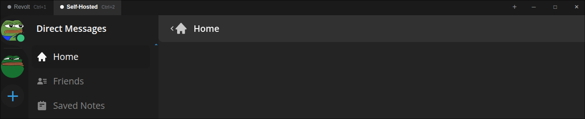

<div align="center">
<h1>
  Multi-Stoat

  [](https://github.com/Brinziber/multi-stoat/stargazers)
  [](https://github.com/Brinziber/multi-stoat/network/members)
  [](https://github.com/Brinziber/multi-stoat/issues)
  [](https://github.com/Brinziber/multi-stoat/blob/main/LICENSE)
</h1>

A community fork of [stoatchat/for-desktop](https://github.com/stoatchat/for-desktop) with multi-instance support.  
Available for Windows, macOS, and Linux.
</div>
<br/>



## What's different from the original?

Multi-Stoat extends the official Stoat desktop client with the ability to connect to **multiple Revolt/Stoat instances simultaneously** — useful for users who operate or participate in self-hosted servers alongside the main Stoat network.

| Feature | Official Stoat | Multi-Stoat |
|---|---|---|
| Connect to stoat.chat | ✅ | ✅ |
| Connect to self-hosted instances | ❌ | ✅ |
| Multiple instances at once | ❌ | ✅ |
| Switch instances via sidebar tabs | ❌ | ✅ |
| Instance manager (add/edit/remove) | ❌ | ✅ |
| Custom sidebar / title bar | ❌ | ✅ |
| All original features (tray, RPC, …) | ✅ | ✅ |

### Multi-instance sidebar

A custom title bar replaces the native window frame. It shows one tab per configured instance and lets you switch between them instantly without opening a new window. Window controls (minimise, maximise, close) are rendered natively per platform.

### Instance manager

An in-app dialog lets you add, rename, and remove instances at any time. Each instance stores a **label** and a **URL** pointing to the Revolt-compatible frontend of your choice.

---

## Installation

> Pre-built binaries are not yet published. Build from source using the instructions below.

### Requirements

- [Git](https://git-scm.com/)
- [Node.js](https://nodejs.org/) (LTS recommended)
- [pnpm](https://pnpm.io/) — enable via `corepack enable`

### Build from source

```bash
# Clone this repository (including assets submodule)
git clone --recursive https://github.com/Brinziber/multi-stoat
cd multi-stoat

# Install dependencies
pnpm i --frozen-lockfile

# Run in development mode
pnpm start

# Build an unpacked bundle
pnpm package

# Build distributable packages (.deb, .zip, Flatpak, …)
pnpm make
```

### Development helpers

```bash
# Point the app at a local Revolt dev server
pnpm start -- --force-server http://localhost:5173

# Install and run the Flatpak build locally (after `pnpm make`)
pnpm install:flatpak
pnpm run:flatpak

# Connect the Flatpak build to a local dev server
pnpm run:flatpak --force-server http://localhost:5173

# NixOS / Nix users
pnpm package
pnpm run:nix
pnpm run:nix --force-server=http://localhost:5173
```

### Assets submodule

Brand assets are tracked as a Git submodule. If they were not cloned automatically, run:

```bash
git -c submodule."assets".update=checkout submodule update --init assets
```

This is required before building. Forks are expected to supply their own assets.

---

## Upstream

This project is a fork of [stoatchat/for-desktop](https://github.com/stoatchat/for-desktop) and is kept in sync with upstream on a best-effort basis. Changes that are general enough may be proposed back via pull request.
